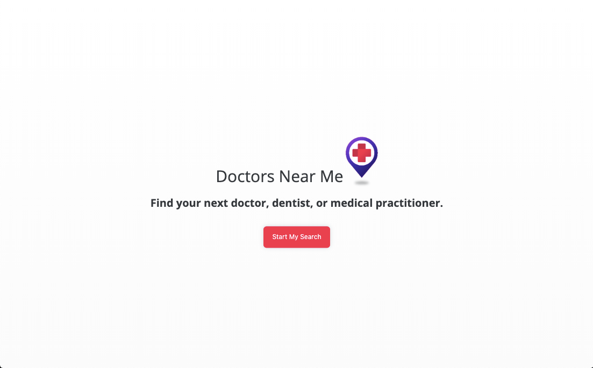
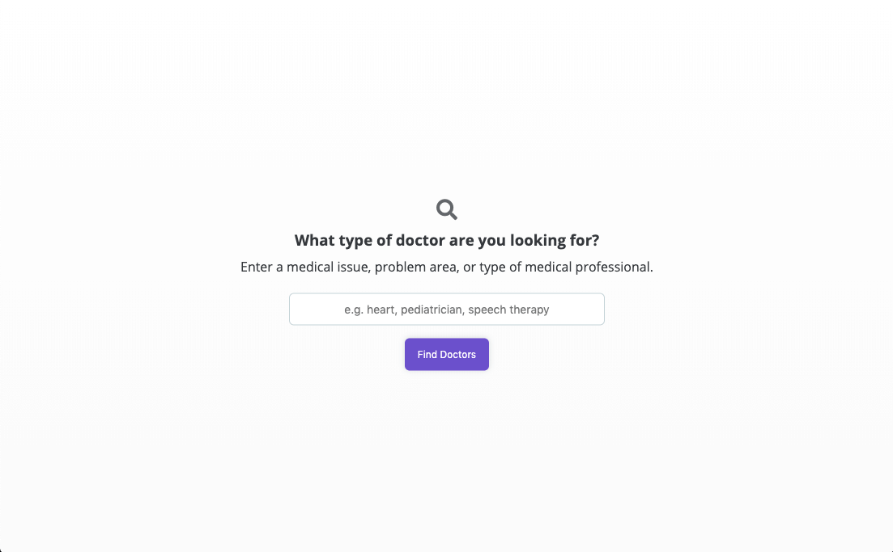
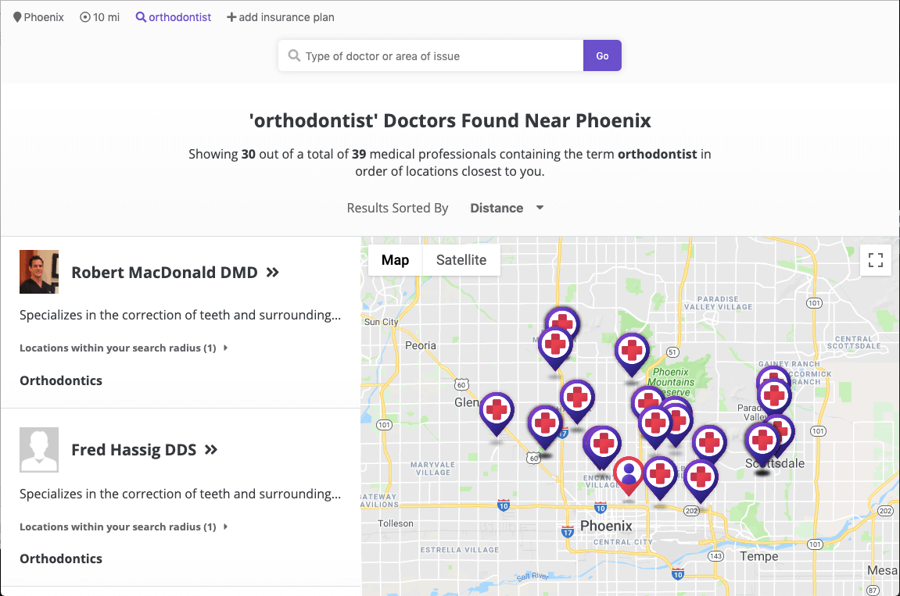
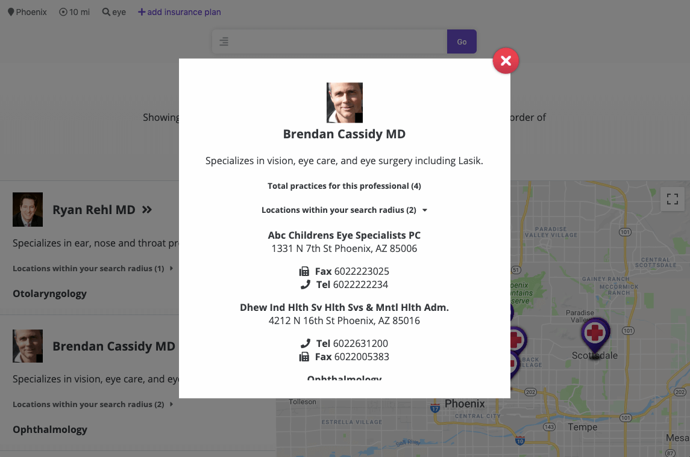
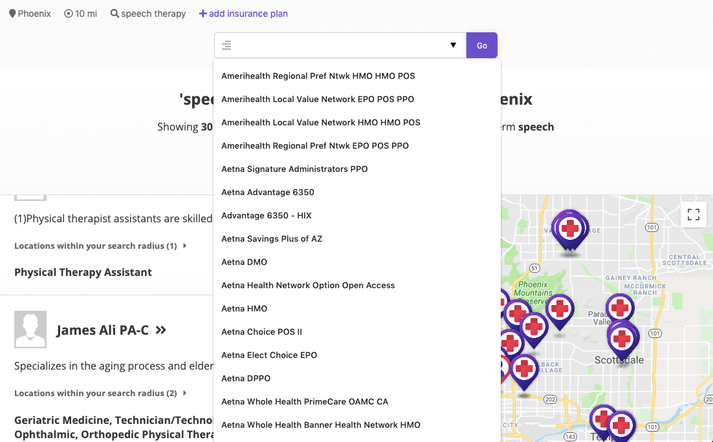

# Doctors Near Me
Find your next medical practitioner with Doctors Near Me, an app that locates and displays
medical professionals based on your location and search inputs.

[https://killeraliens.github.io/doctors-near-me](https://killeraliens.github.io/doctors-near-me/)

## Screenshots & Usage

### Landing

<kbd>
  
</kbd>

### Intro Form
Enter primary search details like your location and query term into the introduction form slides.

<kbd>
  
</kbd>

### Results
See doctors within your search area. You may also change the sort order of results displayed.

<kbd>
  
</kbd>

### See Practitioner Details
Click on a card link or location pin to see a medical practioner's contact and location info.

<kbd>
  
</kbd>

### Refine Your Search
Edit details like your location, search distance, and term directly from the results page. You can also limit results to practitioners that support your insurance plan.

<kbd>
  
</kbd>

## Features

* Locate medical practitioners (doctors, dentists, therapists) near you. View results in a list as well as on a map.
* Filter results based on insurance plans accepted, location, and area of specialty.
* View details on any practioner, including their office locations, area of specialty, and phone/fax information.

## Built With

* HTML
* CSS
* jQuery
* JavaScript
* Better Doctor API
* Google Maps JavaScript API
* Google Geocoding and Reverse Geocoding APIs

